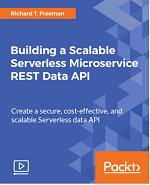
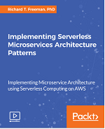

Copyright (c) 2017-2018 Starwolf Ltd and Richard Freeman. All Rights Reserved.

Licensed under the Apache License, Version 2.0 (the "License").
You may not use this file except in compliance with the License.
A copy of the License is located at http://www.apache.org/licenses/LICENSE-2.0 or in the "license" file accompanying this file. This file is distributed on an "AS IS" BASIS, WITHOUT WARRANTIES OR CONDITIONS OF ANY KIND, either express or implied. See the License for the specific language governing permissions and limitations under the License.

# Serverless and Lambdaless Scalable CRUD Data API with AWS API Gateway and DynamoDB

The full details are part of my [Serverless and Lambdaless Scalable CRUD Data API with AWS API Gateway and DynamoDB blog post on Hacknoon](https://hackernoon.com/serverless-and-lambdaless-scalable-crud-data-api-with-aws-api-gateway-and-dynamodb-626161008bb2).

We are moving away from the large and complex monolithic architectures that are hard to scale to Microservices architectures. For example, you could have a loosely coupled fleet of microservices each with an API for each data source, integrating with a clustered NoSQL database, such as Cassandra. Adopting Microservices architecture typically means that you need a DevOps team that, for example, setup, monitor and maintain the continuous integration / continuous deployment (CI/CD) pipelines, [Kubernetes](https://kubernetes.io/) container-orchestration platform and monitoring systems. Things are looking better recently as AWS has announced [Amazon Elastic Container Service for Kubernetes (EKS)](https://aws.amazon.com/eks/) and [AWS Fargate](https://aws.amazon.com/fargate/) that help with Kubernetes, but there is still a lot of integration that needs to be built by developers and containers configuration to think about.  

Back in 2014, AWS launch Lambda functions which act as integration glue between services where you only need to write the business logic code to respond to inbound events. These events could be an GET request from API Gateway, new records added to a Kinesis Streams or an object put into S3. Using Lambda has been very popular as they are stateless, have built in event source integration and you only pay per 100ms of execution time. So rather than use a fleet of Microservices running on containers, you can build a highly scalable Serverless stack integrating API Gateway, Lambda and DynamoDB. There are many tutorials on this including my first [video course](https://www.packtpub.com/application-development/building-scalable-serverless-microservice-rest-data-api-video).

In this repo, I loose the Lambda altogether and have API Gateway directly invoke DynamoDB, to create a full suite of create, read, update, and delete (CRUD) operations. Other posts I've read only cover how to partially do this manually in the AWS console and not in code using [Swagger](https://swagger.io/) and [SAM](https://github.com/awslabs/serverless-application-model), which is what I will show you here. Using Swagger and SAM to deploy the infrastructure and API is realistically what you absolutely want to do to release it to a production environment for minimising human error, repeatability and scalability.

## Shell Scripts and Deployment
I'm only describing a subset that you need to get this code and config deployed and tested, for the full details and discussions see my [Serverless and Lambdaless Scalable CRUD Data API with AWS API Gateway and DynamoDB blog post](https://hackernoon.com/serverless-and-lambdaless-scalable-crud-data-api-with-aws-api-gateway-and-dynamodb-626161008bb2).

### Setup

You need to setup AWS CLI and add you profile in `common-variables.sh` and will also need to change the AWS accountId (currently set to 000000000000). The AWS accountId is also used in some IAM policies in the IAM folder. In addition the region will have to be changed. To replace your accountId (assume your AWS accountId is 111111111111) you can do it manually or run:
```
find ./ -type f -exec sed -i '' -e 's/000000000000/111111111111/' {} \;
```
You will also need to change the AWS region (currently set to eu-west-1). The AWS region is hardcoded to eu-west-1 in some IAM policies in the IAM folder.  To replace it with your region (assume your AWS region is us-east-1) you can do it manually or run:
```
find ./ -type f -exec sed -i '' -e 's/eu-west-1/us-east-1/' {} \;
```
I've done this so you can more easily support multiple AWS Account in a CI pipeline.

### List of scripts:
* Execute `./build-package-deploy-dynamo-data-api.sh` - creates the policies, roles, API Gateway methods and DynamoDB
* `apigateway-dynamo.yaml` - SAM template used to creates DynamoDB config and CRUD API methods.
* `assume-role-api-gateway.json` - the API Gateway assume role
* `dynamo-full-user-comments-api-sam.json` - Policy API Gateway uses to access DynamoDB
* Execute `./delete-stack.sh` - deletes the serverless CloudFormation stack

### Deployment
```
$ aws cloudformation deploy --template-file $template.yaml --stack-name $template --capabilities CAPABILITY_IAM --region $region --profile $profile
```

## Testing the API

Logon to the AWS console > API Gateway or you can also use browser plugins like postman for this.

### Testing the PUT Method or Create

As you have no data in DynamoDB yet, let's start by adding some.
1. Open the [API Gateway](https://console.aws.amazon.com/apigateway/)
2. On the navigation pane, choose apigateway-dynamo and Resources
3. In Resources Click on Put
4. Under /visits - PUT - Method Execution click on Test 
5. In "Request Body" enter the following JSON

```
{"PageId": "444",
"EventCount": 1,
"Message": "happy"}
```

6. Scroll down and click on the Test button.

You will see on the right (or under on mobile devices) Status: 200 which means the call was successful and see a response body. You will also see full API logs, which are useful for testing and debugging. These are also stored in CloudWatch logs, which is the first place you need to look at if you start getting 4XX or 5XX errors.

### Testing the GET method

Now that you have a record in DynamoDB, let's retrieve it using a PageId = 444 query.
1. In resources Click on Put
2. Under /visits/{PageId} - GET - Method Execution click on Test 
3. In Path for {PageId} enter 444 OR in Query Strings for {PageId} enter PageId=444
4. Click on the Test button.

You should get a status: 200 and also see the following Response Body which is what we expect
```
{
  "comments": [
    {
      "PageId": "444",
      "Message": "happy",
      "EventCount": "1"
    }
  ]
}
```

### Testing the POST Method
With the PUT method, you saw that the `EventCount` value remains constant no matter how many times you call it. Now let's test the POST method that increments a counter by the specified value each time it is called.

1. In Resources Click on Post
2. Under /visits - POST - Method Execution click on Test 
2. In "Request Body" enter the following JSON
```
{"PageId": "444",
"EventCount": 1,
"Message": "happy"}
```
You should get a status: 200 and also see the following Response Body
```
  "comments": [
    {
      "PageId": "444",
      "Message": "happy",
      "EventCount": "2"
    }
  ]
}
```

Run it several times and you will see EventCount increment, you can also increment it by more than 1 if you modify the request JSON body EventCount value. Why does this POST method return the current value? It's down to the config `"ReturnValues\": \"ALL_NEW\"` as I wanted to show you the effects of the POST without having to go to the DynamoDB console!

### Testing the DELETE Method

Now that you have a lot of data, maybe you need to delete some records.

1. In resources Click on Delete
2. Under /visits/{PageId} - DELETE - Method Execution click on Test 
3. In Path for {PageId} enter 444 OR in Query Strings for {PageId} enter PageId=444
4. Click on the Test button.

You should get a status: 200 and also see the a Response Body of the deleted record, I used the `"ReturnValues\": \"ALL_OLD\"`.

To double check you can have a look at the DynamoDB in the AWS Console
1. Open the [DynamoDB Console](https://console.aws.amazon.com/dynamodb)
2. Under the navigation click on Tables
3. Under name click on `user-comments-api-sam`
4. On the tab click on Items

You should see the record is no longer there, you can also use the Query drop down to check.

## Clean up

To delete the stack simply run `./delete-stack.sh` here are the contents of the shell script:
```
$ aws cloudformation delete-stack --stack-name $template --region $region --profile $profile
```

Additional discussions on [Serverless and Lambdaless Scalable CRUD Data API with AWS API Gateway and DynamoDB blog post on Hacknoon](https://hackernoon.com/serverless-and-lambdaless-scalable-crud-data-api-with-aws-api-gateway-and-dynamodb-626161008bb2).

Not everything can be done with this Lambdaless approach but Serverless computing can be used in most scenarios. If you want to find out more on Serverless microservices and have more complex use cases, please have a look at my video courses and so support me in writing more blog posts. 

Additional implemented Serverless pattern architecture, source code, shell scripts, config and walkthroughs are provided with my video courses:

|For beginners and intermediates, the [full Serverless Data API](https://www.packtpub.com/application-development/building-scalable-serverless-microservice-rest-data-api-video?utm_source=github) code, configuration and a detailed walk through |For intermediate or advanced users, I cover the implementation of [15+ serverless microservice patterns](https://www.packtpub.com/application-development/implementing-serverless-microservices-architecture-patterns-video?utm_source=github) with original content, code, configuration and detailed walk through |
|:----------|:-------------|
| [](https://www.packtpub.com/application-development/building-scalable-serverless-microservice-rest-data-api-video)|  [](https://www.packtpub.com/application-development/implementing-serverless-microservices-architecture-patterns-video) |

Feel free to connect with me on [LinkedIn](https://www.linkedin.com/in/drfreeman/) or message me on [Medium](https://medium.com/@rfreeman) for comments. 